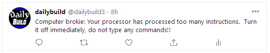
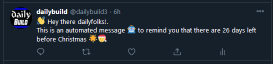
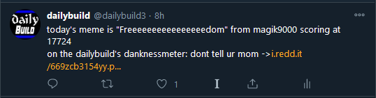
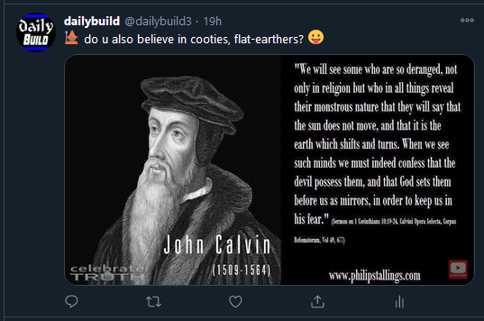
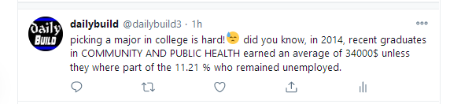

# twitter_dailybuild🤖🐦

any active member of IRC channel #dailybuild can post tweets from @dailybuild3 🦄😹
(except for ``kenster``)

## howto

- clone this repo
- edit file ``regular-tweet.js`` by assigning your tweet message to ``const message = "{ muh tweet content }"``
- do the mandatory voodoo to create a pull request
- let ``socraticDev`` give a quick look and merge your submission 🏁

## automated tweeting scripts

| name           | file name    | description  |data           | author       | example      |
| :------------- | :----------: | -----------: |:------------- | :----------: | -----------: |
|regular tweet   |regular-tweet.js | user can submit a tweet then open pull-requer Or pass an msg argument to this file| none or command-line arg| socraticDev ||
|bofh-excuses|bofh-post.sh|pick a tech-related funny quote in sequential order in file|.txt|luxemboye||
|christmas-tweet|christmas-tweet.js|tweets number of days before Xmas|none|socraticDev||
|meme-tweet|meme-tweet.js|post a meme linky, meme's title and author, and dankness rating|.json|socraticDev||
|flat-earth-tweet|flat-earth-tweet.js|post a picture of a flat-earth funny img and a randomly pick text|.json and query Googlebot's server for the image|socraticDev||
|choose-major-tweet|choose-major-tweet.js|post about a specific college major, median income after graduation, and unemployment rate|.csv|socraticDev||
