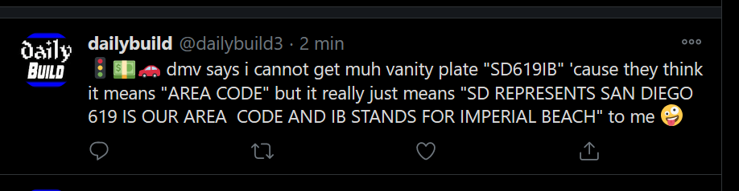

## self-service tweeting

any active member of IRC channel #dailybuild can post tweets from @dailybuild3 🦄😹
(except for `kenster`)

### howto

- clone this repo
- edit file `regular-tweet.js` by assigning your tweet message to `const message = "{ muh tweet content }"`
- do the mandatory voodoo to create a pull request
- let `socraticDev` give a quick look and merge your submission 🏁

### Working with unit tests (Jasmine JavaScript framework)

Using unit tests to fix bugs and develop new scripts will make our lives easier! 

You don't have to test the whole script end-to-end. Isolate _business logic_ in a separate class or function and test these units of work only. 

__tip__: To make sure your message is well-formed (since you dont have access to Twitter API keys), locally, you can comment out the ``Tweet Module`` import statement and the last line where the message is sent by the module. Instead, you can simply ``console.log({your message})`` and see if your message is well-formed.

#### To run all unit tests : 

1. Add a new test file (ending in ``*Spec.js``) in the ``/spec`` directory and write some test scenarios; 
2. In terminal prompt, make sure you are located (``pwd``) at the root of the project;
3. type ``jasmine``;
4. The tests will be ran and a result outputted to same terminal;
5. read the test framework output.

> Tweet modules are assumed to work once integrated in Github Actions where they are feed the SECRET KEYS. Since your script 'integrates' the tweet-modules, you cannot unit test it.

## automated tweeting scripts

Almost all @dailybuild3's tweets are posted from automated scripts on a cron job. Here's a list of the scripts:

| name               |       file name       |                                                                                                                                     description | data source                                      |   author    |                                                                 example |
| :----------------- | :-------------------: | ----------------------------------------------------------------------------------------------------------------------------------------------: | :----------------------------------------------- | :---------: | ----------------------------------------------------------------------: |
| regular tweet      |   regular-tweet.js    |                                                              user can submit a tweet then open pull-requer Or pass an msg argument to this file | none or command-line arg                         | socraticDev |                                                                         |
| bofh-excuses       |     bofh-post.sh      |                                                                                     pick a tech-related funny quote in sequential order in file | .txt                                             |  luxemboye  |                  |
| christmas-tweet    |  christmas-tweet.js   |                                                                                                               tweets number of days before Xmas | none                                             | socraticDev |                  |
| meme-tweet         |     meme-tweet.js     |                                                                                 post a meme linky, meme's title and author, and dankness rating | .json                                            | socraticDev |                  |
| flat-earth-tweet   |  flat-earth-tweet.js  |                                                                               post a picture of a flat-earth funny img and a randomly pick text | .json and query Googlebot's server for the image | socraticDev |      |
| choose-major-tweet | choose-major-tweet.js |                                                      post about a specific college major, median income after graduation, and unemployment rate | .csv                                             | socraticDev |  |
| dmv-tweet          |     dmv-tweet.js      | tweets about the vanity license plate refused by dmv. stating the reason given by dmv's clerk and the actual meaning of plate given by motorist | csv                                              | socraticDev |                            |
